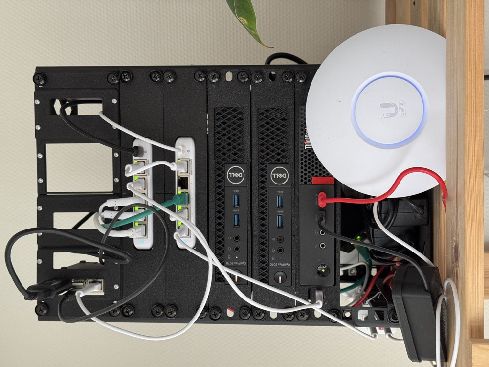

# HomeOps

Infrastructure as Code repository for home infrastructure management.



## Repository Structure

```
homeops/
├── talos/              # Talos Kubernetes cluster configurations
│   └── talos1018/      # Cluster-specific config and patches
├── kubernetes/         # Flux CD GitOps manifests
│   ├── apps/           # Application deployments
│   │   └── talos1018/  # Cluster applications
│   ├── infrastructure/ # Infrastructure components
│   │   └── talos1018/
│   │       ├── core/   # Core components (CNI, ingress, cert-manager)
│   │       └── storage/ # Storage layer (Longhorn)
│   ├── clusters/       # Flux configurations
│   │   └── talos1018/
│   │       ├── flux-system/
│   │       ├── infrastructure.yaml
│   │       └── apps.yaml
│   └── components/     # Shared Kustomize components
├── scripts/            # Automation and validation scripts
├── docs/               # Documentation and assets
└── .github/            # CI/CD workflows
```

## Projects

### Talos1018 Cluster

A 3-node Kubernetes cluster running on Talos Linux. For detailed setup and configuration, see [talos/talos1018/README.md](talos/talos1018/README.md).

- Control plane: 3 nodes
- Network: Cilium CNI with L2 announcements
- IP Range: 10.18.6.90-93

### Infrastructure Architecture

Layered architecture with minimal dependencies:

**Core** (no dependencies):
- Cilium CNI with L2 announcements
- cert-manager with Let's Encrypt
- ingress-nginx

**Storage** (depends on core):
- Longhorn with S3 backups to Cloudflare R2

**Applications** (depends on core):
- Deploy in parallel
- Storage-dependent apps wait automatically via Kubernetes

### Kubernetes GitOps

GitOps with Flux CD. See [kubernetes/README.md](kubernetes/README.md) for details.

- Continuous deployment via Flux CD
- Secret management with SOPS + age
- Automated validation via GitHub Actions

## Prerequisites

- `talosctl`
- `kubectl`
- `helm`
- `flux` CLI
- `sops` (for secret management)

## Getting Started

1. Clone the repository:
```bash
git clone https://github.com/fmurodov/homeops.git
cd homeops
```

2. Navigate to the desired project directory and follow the project-specific README instructions.
